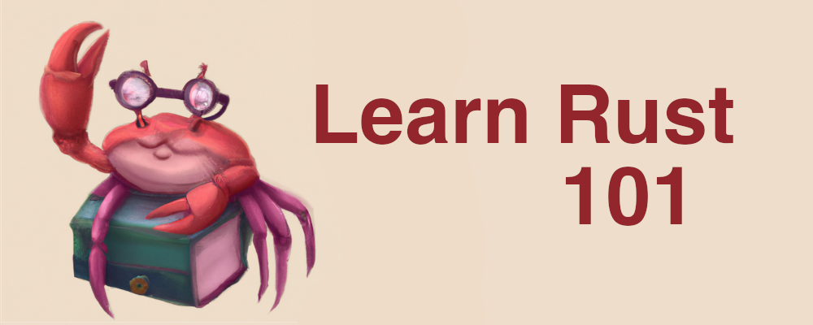

  

 

[rust]: https://www.rust-lang.org/

> ⓘ A guide to aid you in your journey of becoming a Rustacean (Rust developer). See the [Contributing](https://github.com/plabayo/learn-rust-101/blob/main/CONTRIBUTING.md) and [Code of Conduct](https://github.com/plabayo/learn-rust-101/blob/main/CODE_OF_CONDUCT.md) for more information about how to contribute to this repository.

## Disclaimer

This guide is made by [Glen De Cauwsemaecker](https://www.glendc.com/) and is in no way endorsed nor affiliated with the Rust foundation. Rust & Cargo are registered trademarks of the Rust foundation.

## Sharing is caring

This guide is free and will remain gratis available to share for all who are interested or until the overlords at GitHub pull it down.

🗞 This guide was featured [on the front page of HackerNews on the 8th of April 2023](<https://news.ycombinator.com/item?id=35489029>) and in [the weekly edition of the Rust newsletter on the 12th of April 2023](https://this-week-in-rust.org/blog/2023/04/12/this-week-in-rust-490/).

## Prologue

[Rust][rust] is a modern systems programming language with safety in mind as one of its core goals and strengths. Systems programming is programming within a resource constrained environment. However, as a lot of our services run now in paid-for-usage cloud environments, we can also consider them as resource constrained environments. This is why Rust is a great fit for more use cases than people might realize.

As it is a modern language and has taken the lessons from many other languages before it, it is also surprisingly pleasant to use once you get the hang of it. Its type system also allows expressive code that can help you exclude a great categories of bugs beyond the benefits that static typing can bring.

The goal of this guide is to introduce Rust to you as an individual or an entire organization. Should this not be sufficient you can also contact me for 1-on-1 coaching or workshops for your organization, by emailing me at [glen@plabayo.tech](mailto:glen@plabayo.tech). More information on Glen can be found at <https://glendc.com/>.

This guide is fully open source and the complete source code can be found at <https://github.com/plabayo/learn-rust-101>. If you find any errors or have any suggestions, please open an issue or a pull request. If you want to contribute to this guide, please read the [Contributing Guidelines](https://github.com/plabayo/learn-rust-101/blob/main/CONTRIBUTING.md). This guide is licensed under the [MIT License](https://github.com/plabayo/learn-rust-101/blob/main/LICENSE) and developed with love by [Plabayo](https://plabayo.tech/).

## Rust 101 Course

The origins of this guide can be found in the preparation of a semester long course I gave to a group of employees at [OTA Insight Ltd.](https://www.otainsight.com/). The recordings of this course are available on YouTube at: <https://www.youtube.com/playlist?list=PLQgXEsLXFxpVyLddG8FFXfNQEiodTzAjj>. The videos are however not of the highest quality, especially given the many better resources out there.

## Learning Guide

Source code for this guide is available under [./src](./src).

This is the source code of an [mdBook](https://rust-lang.github.io/mdBook/index.html)
served at <https://rust-lang.guide/>.
